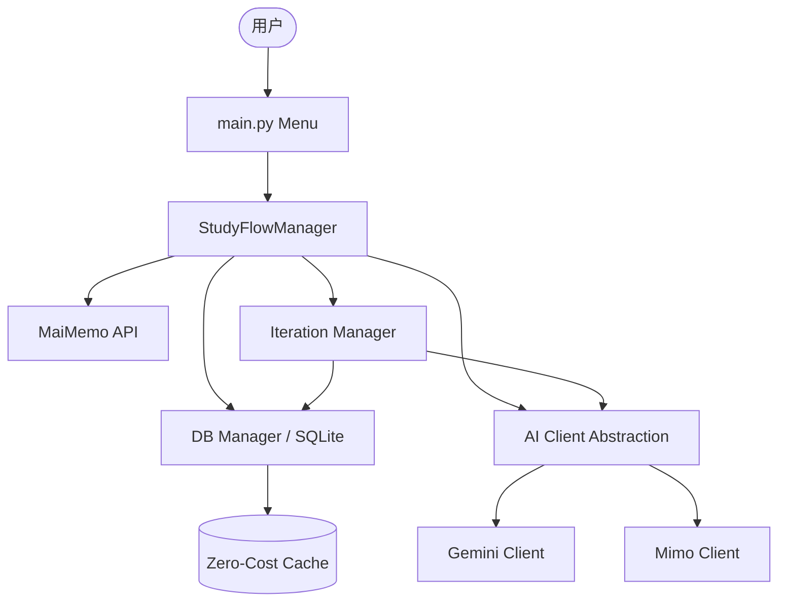

# Momo Study Agent 技术架构与设计手册

本手册详细描述了 `Momo-Study-Agent` 的模块化设计、核心特征以及背后的设计思维，旨在为长期维护和功能扩展提供清晰的指引。

## 1. 系统概览

系统采用**解耦的批处理架构**，将数据获取、AI 生成、持久化存储与云端同步完全分流，以确保在复杂的网络环境或 API 限制下仍能保持数据完整性。

---

## 2. 模块详解

### 2.1 `main.py` (核心编排器)
*   **Feature**: 程序入口，提供交互式菜单，负责 BATCH 分片逻辑。
*   **设计思路**: 
    *   **ESC 中断安全**: 每一处耗时操作都嵌入了键盘监听，确保非正常关闭时能优雅退出并保存已处理结果。
    *   **分阶段执行**: 严格遵循 `获取 -> 过滤 -> AI -> 同步` 的原子化步骤。
*   **架构**: 封装为 `StudyFlowManager` 类，持有 API 和 AI 客户端的实例。

### 2.2 `core/db_manager.py` (持久化中心)
*   **Feature**: 多库隔离、增量快照、社区缓存。
*   **设计思路**:
    *   **横向隔离**: 每个用户拥有独立的 `history_*.db`，互不干扰，符合数据隔离原则。
    *   **Zero-Cost Community Cache**: 跨库检索 `voc_id`，如果其他用户已生成过该词的 AI 笔记，则直接复用，显著降低 API 消耗。
    *   **Incremental Snapshots**: 采用“变动即记录”策略，仅在学习数据变化时存储快照，构建高保真的学习增长曲线。

### 2.3 `core/iteration_manager.py` (智能迭代引擎)
*   **Feature**: 薄弱词自动重炼。
*   **设计思路**:
    *   **反馈驱动**: 利用 `word_progress_history` 表中的熟悉度趋势作为输入信号。
    *   **阶梯式优化 (L0-L2)**: 
        *   **L1 (Selection)**: 从现有生成的多种方法中智能打分选优。
        *   **L2 (Refinement)**: 诊断失败原因，调用更高强度的“重炼”提示词生成高强度关联。

### 2.4 `core/maimemo_api.py` (协议抽象)
*   **Feature**: 墨墨私有 API 的高度仿真库。
*   **设计思路**: 封装了复杂的 Session 维持和 JSON 解析。
*   **架构**: 独立接口类，不包含业务逻辑，仅负责数据的 Request/Response。

### 2.5 `core/gemini_client.py` & `mimo_client.py` (AI 抽象层)
*   **Feature**: 多模型兼容、JSON 鲁棒解析。
*   **设计思路**:
    *   **统一接口**: 均暴露 `generate_mnemonics` 和 `generate_with_instruction` 接口。
    *   **防翻车机制**: 使用 `json_repair` 库处理由于模型 Token 截断或格式偏差导致的破损 JSON。

---

## 3. 核心设计模式

### 3.1 提示词版本指纹 (Prompt Fingerprinting)
*   **痛点**: 提示词修改后，难以确定旧笔记是由哪个版本的 Prompt 生成的。
*   **方案**: 启动时自动计算 Prompt 文件的 MD5 哈希，将其作为 `prompt_version` 存入 `ai_batches` 表，并自动归档原文件到 `data/prompts/`。

### 3.2 冷热数据分离
*   **方案**: 
    *   **热数据**: 内存中的当前任务 batch。
    *   **温数据**: `processed_words` 表，用于极速查重。
    *   **冷数据**: `ai_word_notes` 中的 10+ 维度全量知识，仅在同步或迭代时按需读取。

### 3.3 容错与恢复
*   **方案**: Batch 失败重试机制（带指数退避） + `mark_processed` 延迟标记法，确保即使中途断电，下次运行也能从失败点继续。

---

## 4. 维护说明
*   **增加新字段**: 需要在 `db_manager.py` 的 `_create_tables` 中添加，并更新 `save_ai_word_note`。
*   **更换 AI 提供商**: 继承 `AIClient` 基类并在 `main.py` 的初始化逻辑中路由即可。
