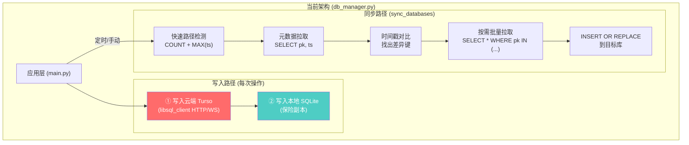
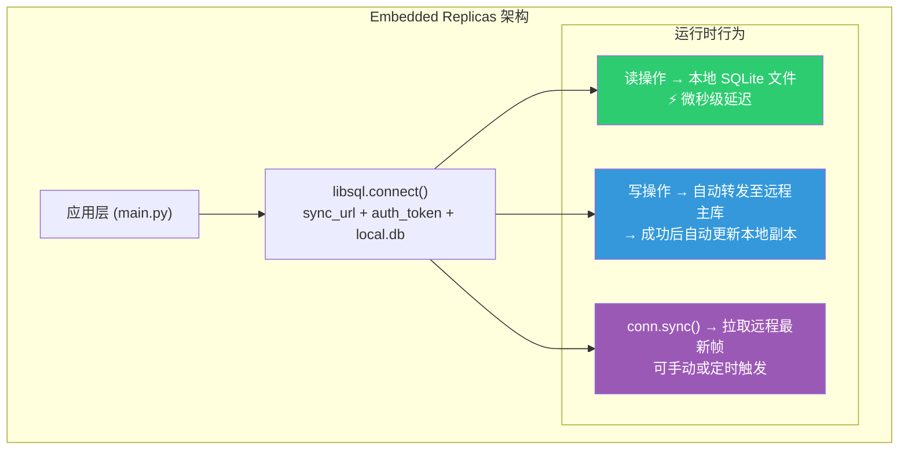
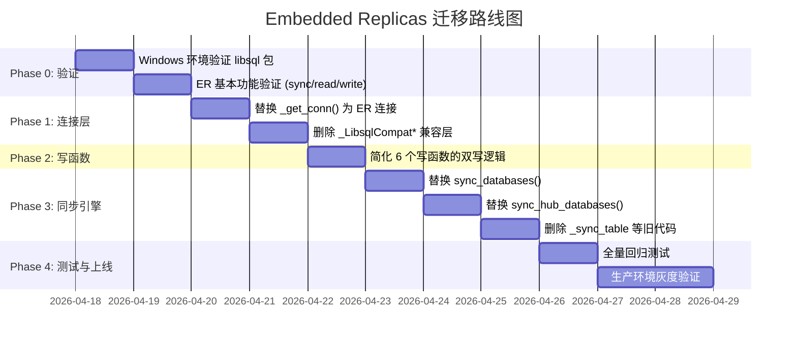

# Turso Embedded Replicas 架构升级分析

> **目标**: 评估使用 `libsql.connect(sync_url=...)` (Turso Embedded Replicas) 完全替代 `db_manager.py` 中手工 `_sync_table` 增量同步逻辑的可行性、收益与风险。

> **状态说明（2026-04-17）**: 本文档为迁移前分析稿；Phase 0-4 已完成落地。执行结果请参考 `docs/dev/EMBEDDED_REPLICAS_PHASE_0_2_COMPLETION.md`、`docs/dev/PHASE_3_SYNC_OPTIMIZATION.md`、`docs/dev/PHASE_4_TESTING_VALIDATION.md`。

---

## 1. 现有架构诊断

### 1.1 当前同步模型：手工双写 + 定时增量对比



### 1.2 核心痛点量化

| 痛点 | 涉及代码 | 影响 |
|------|----------|------|
| **双写延迟叠加** | `save_ai_word_note()` L963-981, `mark_processed()` L896-913 | 每次写操作都要分别连接云端和本地，延迟翻倍 |
| **`_sync_table` 复杂度** | L1728-1820 (93行) | 手工实现元数据拉取、时间戳对比、分块批量应用 |
| **`_sync_progress_history` 特殊逻辑** | L1823-1888 (66行) | 大表同步需要单独的增量策略 |
| **`_sync_hub_table` 重复实现** | L2742-2843 (102行) | Hub 库几乎复制了一遍同步逻辑 |
| **`_LibsqlCompatCursor/Connection`** | L532-635 (104行) | 手工适配 libsql_client 的 sqlite3 兼容层 |
| **连接重试与回退** | `_get_conn()` L657-728, `_get_cloud_conn()` L590-635 | 多协议握手探测 + 失败回退 |
| **总同步代码量** | ~400+ 行 | 占 `db_manager.py` 总 2845 行的 **14%** |

---

## 2. Embedded Replicas 架构

### 2.1 核心原理

Turso Embedded Replicas 在客户端维持一个本地 SQLite 文件，该文件通过 **libsql 协议**（基于 sqld 的帧复制）与远程 Turso 主库保持同步。



### 2.2 关键行为

| 行为 | 说明 |
|------|------|
| **读取** | 始终从本地 SQLite 文件读取，延迟为微秒级 |
| **写入** | 自动转发到远程主库，成功后本地副本自动更新 |
| **同步** | `conn.sync()` 拉取远程所有新帧到本地（增量拉取） |
| **冲突解决** | **Last-Push-Wins**（行级），最后一次推送覆盖 |
| **离线支持** | 最新版本支持 Offline Writes，允许先本地写、后推送 |

---

## 3. 依赖包迁移

### 现状 vs 目标

| 项目 | 现状 | 目标 |
|------|------|------|
| **包名** | `libsql-client` (已 deprecated) | `libsql` (官方新 SDK) |
| **连接方式** | `libsql_client.create_client_sync(url, auth_token=...)` → 纯远程 HTTP/WS | `libsql.connect("local.db", sync_url=url, auth_token=token)` → 本地+远程 |
| **读路径** | 每次 `SELECT` 走网络到 Turso | `SELECT` 走本地文件，零网络开销 |
| **写路径** | 每次 `INSERT/UPDATE` 走网络 + 手工写本地 | `INSERT/UPDATE` 自动转发远程 + 自动同步本地 |
| **同步逻辑** | `_sync_table` 手工 400+ 行 | `conn.sync()` 一行调用 |

### requirements.txt 变更

```diff
-libsql-client
+libsql
```

---

## 4. 代码消除清单

以下代码在迁移后可以**完全删除**：

### 4.1 兼容层（~104行）

```python
# 完全删除：L532-635
class _LibsqlCompatCursor:    # 手工适配 sqlite3 风格接口
class _LibsqlCompatConnection: # 手工包装 libsql_client
def _get_cloud_conn():        # 多协议握手探测
```

**替代方案**: `libsql.connect()` 原生返回 sqlite3 兼容的 Connection 对象。

### 4.2 同步引擎（~260行）

```python
# 完全删除：L1728-1888, L2742-2843
def _sync_table():                # 手工增量同步（93行）
def _sync_progress_history():     # 大表特殊同步（66行）
def _sync_hub_table():            # Hub 重复同步（102行）
```

**替代方案**: `conn.sync()` 一行调用。

### 4.3 双写逻辑简化

每个写函数中的 **"优先云端 → 同步本地缓存 → 云端失败回退本地"** 模式可以全部消除：

```python
# 示例：save_ai_word_note 中的双写模式（~20行/函数）
# 当前：
try:
    cloud_conn = _get_conn(path)
    if _is_cloud_connection(cloud_conn):
        _do_sql(cloud_conn)           # 写云端
        try:
            _do_sql(_get_local_conn(path))  # 写本地
        except:
            pass
    else:
        _do_sql(cloud_conn)           # 本地连接
except:
    _do_sql(_get_local_conn(path))    # 回退本地

# 迁移后：
conn = get_db_connection()  # Embedded Replica 连接
_do_sql(conn)               # 一次写入，自动同步
```

**涉及函数**: `save_ai_word_note`, `mark_processed`, `save_ai_word_iteration`, `set_note_sync_status` 等至少 **6 个** 写函数。

---

## 5. 核心伪代码示例

### 5.1 连接层重构

```python
# ==========================================
# 新版 db_manager.py - 连接层
# ==========================================
import libsql
import os
import threading

# 全局连接池（线程安全的单例模式）
_conn_cache = {}
_conn_lock = threading.Lock()

def _get_conn(db_path: str = None) -> libsql.Connection:
    """获取 Embedded Replica 数据库连接
    
    行为:
      - 读操作: 直接从本地 SQLite 文件读取（微秒级）
      - 写操作: 自动转发到远程 Turso 主库，成功后自动更新本地
      - 离线模式: 如果未配置云端凭据，退化为纯本地 SQLite
    """
    path = db_path or DB_PATH
    cache_key = os.path.abspath(path)
    
    with _conn_lock:
        if cache_key in _conn_cache:
            return _conn_cache[cache_key]
    
    url = os.getenv('TURSO_DB_URL')
    token = os.getenv('TURSO_AUTH_TOKEN')
    
    if url and token:
        # ✅ Embedded Replica 模式（核心变化）
        conn = libsql.connect(
            path,                    # 本地 SQLite 文件路径
            sync_url=url,            # 远程 Turso 主库 URL
            auth_token=token,        # 认证令牌
        )
        # 首次连接时立即同步一次，确保本地数据最新
        conn.sync()
        _debug_log(f"Embedded Replica 连接就绪: {path} ↔ {url}")
    else:
        # 纯本地模式（无云端配置时回退）
        conn = libsql.connect(path)
        _debug_log(f"纯本地模式: {path}")
    
    with _conn_lock:
        _conn_cache[cache_key] = conn
    
    return conn


def _get_hub_conn() -> libsql.Connection:
    """Hub 数据库同理"""
    hub_url = os.getenv('TURSO_HUB_DB_URL')
    hub_token = os.getenv('TURSO_HUB_AUTH_TOKEN')
    
    if hub_url and hub_token:
        conn = libsql.connect(
            HUB_DB_PATH,
            sync_url=hub_url,
            auth_token=hub_token,
        )
        conn.sync()
        return conn
    else:
        return libsql.connect(HUB_DB_PATH)
```

### 5.2 写函数简化

```python
# ==========================================
# 写函数 - 消除所有双写逻辑
# ==========================================

def save_ai_word_note(voc_id: str, payload: dict, db_path=None, metadata=None):
    """保存 AI 笔记 - 极简版
    
    写入 Embedded Replica 连接:
      - 写操作自动转发远程主库
      - 成功后本地 SQLite 自动更新
      - 无需手工双写、无需回退逻辑
    """
    conn = _get_conn(db_path)
    cur = conn.cursor()
    
    # ...（参数准备逻辑不变）...
    
    cur.execute(
        'INSERT OR REPLACE INTO ai_word_notes (...) VALUES (...)',
        args
    )
    conn.commit()
    # ✅ 结束。无需额外的本地缓存同步。


def mark_processed(voc_id: str, spelling: str, db_path=None):
    """标记已处理 - 极简版"""
    conn = _get_conn(db_path)
    conn.execute(
        'INSERT OR REPLACE INTO processed_words (voc_id, spelling, updated_at) VALUES (?, ?, ?)',
        (str(voc_id), spelling, get_timestamp_with_tz())
    )
    conn.commit()
    # ✅ Done.
```

### 5.3 同步函数重构

```python
# ==========================================
# 同步函数 - 从 400+ 行降至 ~30 行
# ==========================================

def sync_databases(db_path=None, progress_callback=None) -> dict:
    """数据库同步 - Embedded Replica 版本
    
    核心逻辑:
      conn.sync() 执行基于 WAL 帧的增量同步。
      Turso 在服务器端跟踪每个 Replica 的同步点位，
      每次 sync() 只传输未见过的新帧。
    """
    stats = {'upload': 0, 'download': 0, 'status': 'ok'}
    
    conn = _get_conn(db_path)
    
    if not hasattr(conn, 'sync'):
        # 纯本地模式，无需同步
        stats['status'] = 'skipped'
        stats['reason'] = 'local-only'
        return stats
    
    try:
        _emit_sync_progress(progress_callback, 'sync', 1, 1, '执行帧级增量同步...')
        
        sync_result = conn.sync()
        
        # sync_result 可能包含帧数或变更统计
        stats['status'] = 'ok'
        stats['frames_synced'] = getattr(sync_result, 'frames_synced', 0)
        
        _emit_sync_progress(progress_callback, 'done', 1, 1, '同步完成')
        
    except Exception as e:
        stats['status'] = 'error'
        stats['reason'] = str(e)
    
    return stats


def sync_hub_databases(progress_callback=None) -> dict:
    """Hub 同步 - 同理"""
    hub_conn = _get_hub_conn()
    
    if hasattr(hub_conn, 'sync'):
        hub_conn.sync()
        return {'status': 'ok'}
    
    return {'status': 'skipped', 'reason': 'local-only'}
```

### 5.4 社区查询优化

```python
# ==========================================
# 社区查询 - 利用本地读取的极速优势
# ==========================================

def find_words_in_community_batch(voc_ids: list, **kwargs) -> dict:
    """批量社区查询 - 利用 Embedded Replica 的本地读取
    
    优势:
      - 当前架构: 需要分别连接多个云端库、逐个尝试
      - ER 架构: 所有数据已在本地副本中，直接查询
      
    前提:
      - 需要在 sync() 时将社区数据源也纳入同步范围
      - 或者保留云端补查作为备用路径
    """
    result = {}
    conn = _get_conn()
    cur = conn.cursor()
    
    # 本地查询：微秒级完成
    placeholders = ','.join(['?'] * len(voc_ids))
    cur.execute(f'''
        SELECT n.*, b.ai_provider, b.prompt_version
        FROM ai_word_notes n
        LEFT JOIN ai_batches b ON n.batch_id = b.batch_id
        WHERE n.voc_id IN ({placeholders})
    ''', voc_ids)
    
    for row in cur.fetchall():
        note = _row_to_dict(cur, row)
        vid = note.get('voc_id')
        if vid:
            result[vid] = (note, "Embedded Replica")
    
    return result
```

---

## 6. 效率对比分析

### 6.1 读取性能

| 场景 | 当前架构 | Embedded Replicas | 提升 |
|------|---------|------------------|------|
| 单词查询 `get_word_note()` | ~50-200ms (HTTP 到 Turso) | **<1ms** (本地文件) | **50-200x** |
| 批量社区查询 (100词) | ~500-2000ms (多云库串行) | **<10ms** (本地) | **50-200x** |
| 已处理检查 `is_processed()` | ~50-200ms (网络) | **<1ms** (本地) | **50-200x** |

### 6.2 写入性能

| 场景 | 当前架构 | Embedded Replicas | 变化 |
|------|---------|------------------|------|
| 单条写入 | ~200-400ms (云端+本地双写) | ~100-200ms (转发远程) | **~2x 提升** |
| 批量写入 (50词) | ~500-1500ms (批量双写) | ~200-500ms (批量转发) | **~2-3x 提升** |

### 6.3 同步性能

| 场景 | 当前架构 | Embedded Replicas | 变化 |
|------|---------|------------------|------|
| 全量同步 (5张表) | ~3-10s (元数据拉取+对比+批量应用) | **<1s** (帧级增量) | **3-10x 提升** |
| 增量同步 (少量变更) | ~1-3s (仍需全部元数据扫描) | **<200ms** (仅传新帧) | **5-15x 提升** |
| 无变更时 | ~500ms-1s (快速路径检测) | **<50ms** (帧校验) | **10-20x 提升** |

### 6.4 代码量

| 指标 | 当前 | 迁移后 | 减少 |
|------|------|--------|------|
| 同步相关代码 | ~400+ 行 | ~30 行 | **93%** |
| 兼容层代码 | ~104 行 | 0 行 | **100%** |
| 双写逻辑 | ~120 行 (6个函数) | 0 行 | **100%** |
| **总减少量** | — | — | **~600+ 行** |

---

## 7. 风险评估

### 7.1 需要注意的风险

| 风险 | 严重程度 | 缓解策略 |
|------|---------|----------|
| **`libsql` 包 Windows 兼容性** | 🔴 高 | 迁移前必须在 Windows 环境验证 `pip install libsql` 和嵌入式副本功能 |
| **本地文件锁冲突** | 🟡 中 | 确保同一进程内只有一个 `libsql.connect()` 实例访问同一文件 |
| **写入延迟（远程转发）** | 🟢 低 | 与当前云端写入延迟相当，但省去了本地双写开销 |
| **Last-Push-Wins 冲突** | 🟡 中 | 当前场景为单用户单设备，冲突概率极低；多用户场景通过各自独立库隔离 |
| **`conn.sync()` 计费** | 🟡 中 | 每次 sync 消耗 Turso 带宽配额，需要控制同步频率 |
| **多库查询退化** | 🟡 中 | 社区查询涉及多个用户库，无法用单个 ER 连接覆盖，需保留部分远程查询 |

### 7.2 不可消除的模块

> [!IMPORTANT]
> 以下功能**无法**被 Embedded Replicas 完全替代，需要保留或调整：

1. **多库社区查询** (`find_words_in_community_batch`): 需要连接其他用户的 Turso 库进行跨库查询。ER 只能管理"自己的库"的本地副本，无法自动同步别人的库。
   - **策略**: 保留远程查询作为"社区补查"路径，但将当前用户自己的库查询迁移到 ER 本地读取。

2. **Turso Management API 发现** (`_fetch_turso_cloud_targets_via_api`): 用于发现其他用户的历史库 URL。这是管理层逻辑，与 ER 无关。

3. **Hub 数据库的写入冲突**: Hub 是共享库（多用户写入），Last-Push-Wins 在极端情况下可能丢失数据。
   - **策略**: Hub 表设计天然是追加型 (INSERT) 为主，覆盖风险低。`users` 表已设计为"以云端为权威"。

---

## 8. 结论与建议

### 8.1 是否值得？

> [!TIP]
> **结论：非常值得**。这是一个"高收益、中等工作量、低风险"的升级。

| 维度 | 评分 | 说明 |
|------|------|------|
| **性能提升** | ⭐⭐⭐⭐⭐ | 读取提升 50-200x，同步提升 3-15x |
| **代码简化** | ⭐⭐⭐⭐⭐ | 减少 ~600 行同步代码，维护成本大幅下降 |
| **可靠性** | ⭐⭐⭐⭐ | 消除手工双写的竞态条件和不一致风险 |
| **迁移工作量** | ⭐⭐⭐ | 中等（~2-3天），需要仔细处理连接池和多库场景 |
| **风险** | ⭐⭐ (低) | 主要风险是 Windows 下 `libsql` 包的兼容性 |

### 8.2 推荐分阶段迁移路线



### 8.3 Phase 0 验证脚本（建议首先执行）

```python
"""
Phase 0: Windows 环境验证脚本
运行方式: pip install libsql && python verify_embedded_replica.py
"""
import os
import tempfile

def test_embedded_replica():
    import libsql
    
    url = os.getenv('TURSO_DB_URL')
    token = os.getenv('TURSO_AUTH_TOKEN')
    
    if not url or not token:
        print("❌ 未配置 TURSO_DB_URL / TURSO_AUTH_TOKEN")
        return False
    
    local_path = os.path.join(tempfile.gettempdir(), "er_test.db")
    
    try:
        # 1. 创建 Embedded Replica 连接
        conn = libsql.connect(local_path, sync_url=url, auth_token=token)
        print(f"✅ 连接创建成功: {local_path}")
        
        # 2. 同步远程数据到本地
        conn.sync()
        print("✅ sync() 成功")
        
        # 3. 本地读取验证
        result = conn.execute("SELECT COUNT(*) FROM processed_words").fetchone()
        print(f"✅ 本地读取成功: processed_words 有 {result[0]} 条记录")
        
        # 4. 写入验证（写入后读回）
        conn.execute(
            "INSERT OR REPLACE INTO system_config (key, value) VALUES (?, ?)",
            ("_er_test_key", "embedded_replica_works")
        )
        conn.commit()
        
        verify = conn.execute(
            "SELECT value FROM system_config WHERE key = ?",
            ("_er_test_key",)
        ).fetchone()
        assert verify[0] == "embedded_replica_works"
        print("✅ 写入 + 读回验证成功")
        
        # 5. 清理测试数据
        conn.execute("DELETE FROM system_config WHERE key = '_er_test_key'")
        conn.commit()
        
        print("\n🎉 所有验证通过！可以进入 Phase 1 迁移。")
        return True
        
    except Exception as e:
        print(f"\n❌ 验证失败: {e}")
        print("   可能原因: libsql 包不支持当前 Windows 环境，或网络连接问题")
        return False
    finally:
        # 清理临时文件
        for ext in ("", "-wal", "-shm"):
            try:
                os.remove(local_path + ext)
            except:
                pass

if __name__ == "__main__":
    test_embedded_replica()
```

---

## 附录 A: 当前代码 → 新代码对照表

| 当前代码位置 | 功能 | 迁移后状态 |
|-------------|------|-----------|
| L16-20 `import libsql_client` | 旧包导入 | → `import libsql` |
| L532-569 `_LibsqlCompatCursor` | 手工游标适配 | → **删除** |
| L572-635 `_LibsqlCompatConnection` + `_get_cloud_conn` | 手工连接适配 | → **删除** |
| L590-635 `_get_cloud_conn()` | 多协议握手 | → **删除** |
| L637-642 `_is_cloud_connection()` | 连接类型判断 | → **删除** |
| L657-728 `_get_conn()` | 云端/本地路由 | → **重写** (5.1) |
| L886-913 `mark_processed()` | 双写模式 | → **简化** (5.2) |
| L938-981 `save_ai_word_note()` | 双写模式 | → **简化** (5.2) |
| L1057-1121 `save_ai_word_iteration()` | 双写模式 | → **简化** |
| L1123-1234 `set_note_sync_status()` | 双写+回退 | → **简化** |
| L1606-1705 `sync_databases()` | 同步编排 | → **重写** (5.3) |
| L1728-1820 `_sync_table()` | 增量同步 | → **删除** |
| L1823-1888 `_sync_progress_history()` | 大表同步 | → **删除** |
| L1899-1939 `_get_hub_conn()` | Hub 连接 | → **重写** (5.1) |
| L2528-2740 `sync_hub_databases()` | Hub 同步 | → **重写** (5.3) |
| L2742-2843 `_sync_hub_table()` | Hub 增量同步 | → **删除** |
