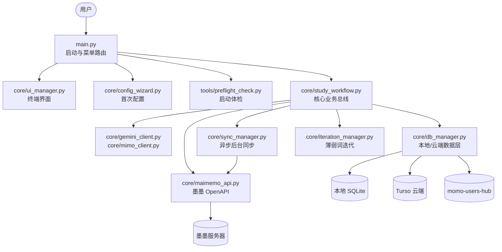

# Momo Study Agent — 架构入口

> 本目录只保留架构视角的总览与导航。实现细节分别放到 [SYSTEM_ARCHITECTURE.md](SYSTEM_ARCHITECTURE.md)、[DATA_FLOW.md](DATA_FLOW.md)、[DATABASE_DESIGN.md](DATABASE_DESIGN.md) 与 [decision_flow.md](decision_flow.md)。

## 定位

Momo Study Agent 是一个基于墨墨背单词 OpenAPI 的多用户 CLI 工具。主流程负责拉取今日/未来词汇、调用 AI 生成助记、写回墨墨，并将用户数据同步到本地 SQLite 和 Turso 云端。

## 架构分层

## 当前关键事实

- 主流程入口是 [main.py](../../main.py)，负责系统级配置与环境初始化。真正的业务引擎被剥离在 [core/study_workflow.py](../../core/study_workflow.py)。
- 后台并发网络同步、断点续传队列被专门交给 [core/sync_manager.py](../../core/sync_manager.py) 统筹。
- UI 呈现和终端输入均委托给 [core/ui_manager.py](../../core/ui_manager.py)。
- 持久化中心是 [core/db_manager.py](../../core/db_manager.py)，其内建了「写操作消息队列」以承载高并发。
- 新用户向导是 [core/config_wizard.py](../../core/config_wizard.py)；启动前体检是 [tools/preflight_check.py](../../tools/preflight_check.py)。
- AI 客户端抽象是 [core/gemini_client.py](../../core/gemini_client.py) 与 [core/mimo_client.py](../../core/mimo_client.py)。

## 推荐阅读顺序

1. [SYSTEM_ARCHITECTURE.md](SYSTEM_ARCHITECTURE.md) 看模块边界和职责。
2. [DATA_FLOW.md](DATA_FLOW.md) 看主流程和同步路径。
3. [DATABASE_DESIGN.md](DATABASE_DESIGN.md) 看表结构和同步策略。
4. [decision_flow.md](decision_flow.md) 看配置与启动分支。

## 不在本页展开的内容

- 详细日志配置请看 [../dev/LOGGING.md](../dev/LOGGING.md)
- 代码规范与 AI 执行规范请看 [../dev/AI_CONTEXT.md](../dev/AI_CONTEXT.md)
