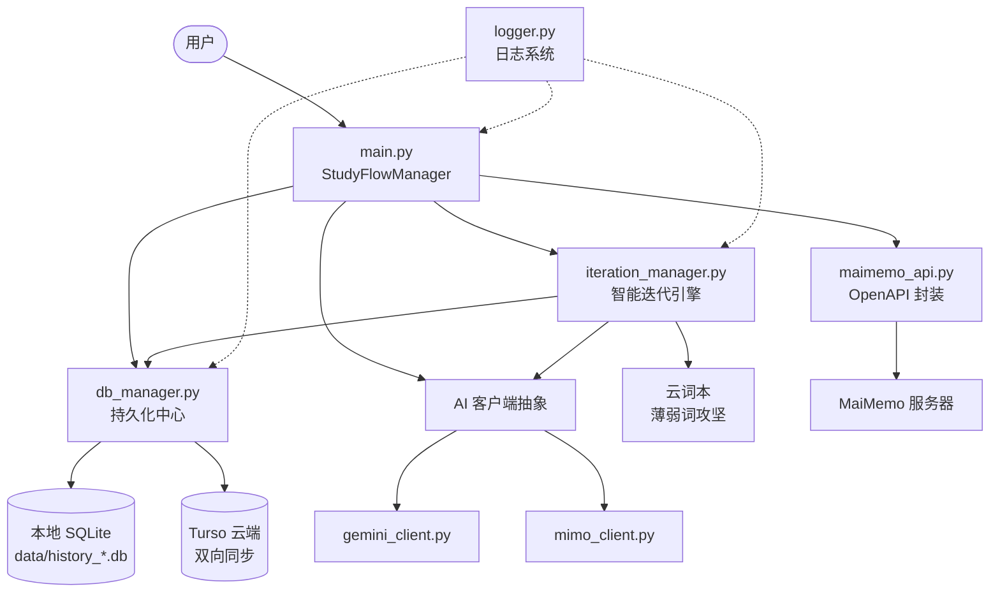

# Momo Study Agent — 系统架构概览

> 本文档面向开发者和 AI 助手，提供当前系统的完整架构快照。

---

## 系统定位

多用户、跨设备的英语单词助记自动化平台。通过 MaiMemo OpenAPI 获取每日词汇，调用 AI 模型生成结构化助记笔记，写回 MaiMemo App，并用本地 SQLite + 云端 Turso 持久化所有数据。

---

## 整体数据流



---

## 模块详解

### `main.py` — 核心编排器
- **职责**：主菜单、批处理调度、ESC 中断安全
- **设计**：封装为 `StudyFlowManager` 类，持有 API 和 AI 客户端实例
- **流程**：获取 → 过滤（查重）→ AI 生成 → 写回 → 同步

### `core/db_manager.py` — 持久化中心
- **职责**：所有数据库读写，本地 ↔ Turso 双向同步
- **关键函数**：`_get_conn()`（自动路由本地/云端）、`_row_to_dict()`（兼容 Row 格式）、`sync_databases()`
- **设计**：每用户独立数据库；社区缓存机制（跨用户复用 AI 笔记）

### `core/maimemo_api.py` — 协议抽象
- **职责**：MaiMemo OpenAPI 完整封装（释义/助记/例句/云词本/学习数据）
- **接口**：`sync_interpretation()`、`create_note()`、`list_notepads()`、`create_notepad()`、`update_notepad()`

### `core/iteration_manager.py` — 智能迭代引擎
- **职责**：薄弱词检测 → AI 重炼 → 推送至专属云词本
- **逻辑**：
  - L0 → L1（选优同步）：对首次检测词，AI 打分选出最优助记
  - L1 → L2（强力重炼）：对退步/停滞词，调用高强度 Prompt 重新生成
  - 重炼完成后批量写入 `MomoAgent: 薄弱词攻坚` 云词本（不影响主线复习队列）

### `core/gemini_client.py` & `core/mimo_client.py` — AI 抽象层
- **职责**：多模型兼容，统一暴露 `generate_mnemonics` + `generate_with_instruction`
- **容错**：`json_repair` 库处理破损 JSON；logger 收容解析异常

### `core/logger.py` — 企业级日志系统
- **文件输出**：结构化 JSON（含时间戳、用户、会话、模块、耗时）
- **控制台输出**：`[LEVEL] message` 可读文本（不输出 JSON）
- **使用**：`from core.logger import get_logger; get_logger().info(...)`

---

## 核心设计模式

### Prompt 版本指纹
启动时自动计算 Prompt 文件 MD5，存入 `ai_batches.prompt_version`，并将原文归档至 `data/prompts/`，便于追溯任何历史笔记由哪个版本 Prompt 生成。

### 冷热数据分离
- **热**：内存中的当前任务 Batch
- **温**：`processed_words` 表（极速查重）
- **冷**：`ai_word_notes` 中的全量知识（仅同步/迭代时读取）

### 容错与恢复
Batch 失败带指数退避重试 + `mark_processed` 延迟标记法，确保中途断电后下次从失败点继续，不重复调用 AI。

---

## 目录结构

```
e:\MOMO_Script\
├── main.py               # 入口
├── config.py             # 全局配置与路径
├── core/                 # 核心模块
│   ├── db_manager.py
│   ├── maimemo_api.py
│   ├── iteration_manager.py
│   ├── gemini_client.py
│   ├── mimo_client.py
│   ├── logger.py
│   ├── log_archiver.py
│   ├── profile_manager.py
│   └── config_wizard.py
├── data/                 # 运行时数据（gitignore）
│   ├── profiles/         # 用户配置 .env
│   └── prompts/          # Prompt 历史归档
├── docs/                 # 文档体系
│   ├── architecture/     # 架构设计文档
│   ├── api/              # 外部 API 参考
│   ├── prompts/          # Prompt 源文件
│   ├── guides/           # 操作指南
│   └── dev/              # 开发者规约
├── logs/                 # 用户日志（gitignore）
├── tests/                # 测试文件
└── scripts/              # 工具脚本
```
