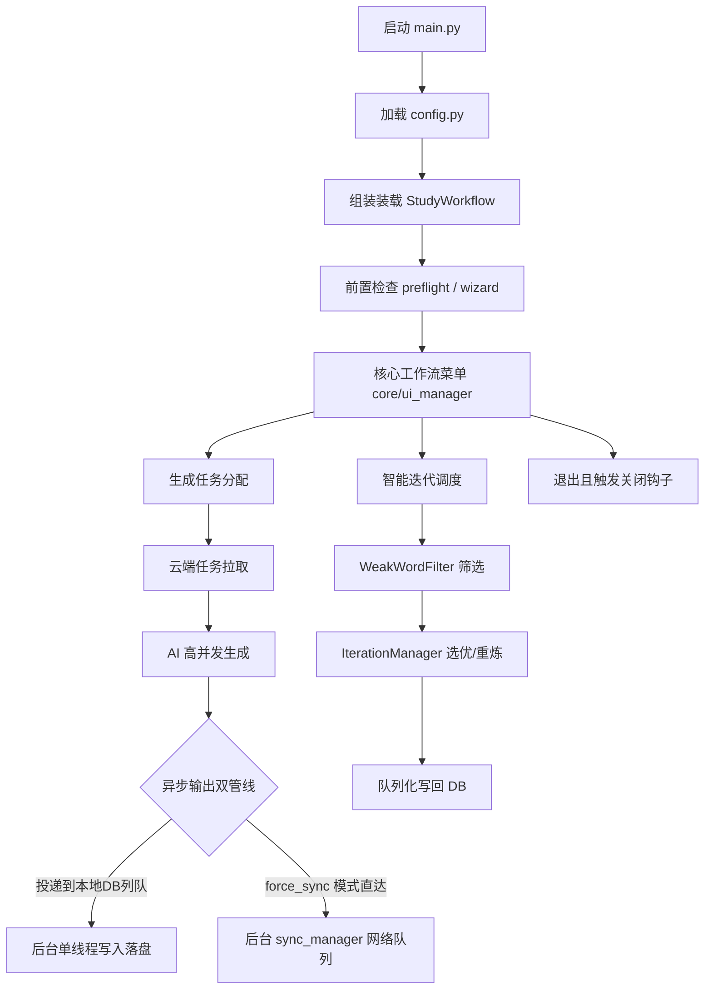

# 系统架构

> 这里描述的是代码模块边界和调用关系，不重复实现细节。

## 模块边界

- [main.py](../../main.py) 轻量级配置、环境拉起与路由启动器。
- [config.py](../../config.py) 负责路径、用户 profile 和全局配置加载。
- [core/config_wizard.py](../../core/config_wizard.py) 负责新用户初始化、凭证保存和预检提示。
- [core/study_workflow.py](../../core/study_workflow.py) 负责系统业务管线、过滤去重和 AI 生成投递。
- [core/ui_manager.py](../../core/ui_manager.py) 负责终端展示形态的统一渲染与用户交互。
- [core/sync_manager.py](../../core/sync_manager.py) 专门负责维护高吞吐的多任务后台同步排队机制。
- [core/db_manager.py](../../core/db_manager.py) 负责本地多线程安全访问、写队列排队（守护线程单库写入）与 Turso/Hub 配置。
- [core/maimemo_api.py](../../core/maimemo_api.py) 负责墨墨 API 调用与上游限流的封锁。
- [core/gemini_client.py](../../core/gemini_client.py) 与 [core/mimo_client.py](../../core/mimo_client.py) 负责 AI 助记生成。
- [core/iteration_manager.py](../../core/iteration_manager.py) 负责薄弱词识别、选优和重炼。
- [core/logger.py](../../core/logger.py) 负责日志输出与性能统计。

## 主流程调用链

## 关键运行规则

- AI 提供商由 `AI_PROVIDER` 决定，当前支持 `mimo` 和 `gemini`。
- 数据同步是“本地 SQLite + Turso”双轨，不是纯云端。
- 中央 Hub 是用户元数据与审计层，独立于用户学习数据仓库。
- 主流程允许后台同步，退出前会再做一次安全同步。

## 相关文档

- [DATA_FLOW.md](DATA_FLOW.md)
- [DATABASE_DESIGN.md](DATABASE_DESIGN.md)
- [../dev/AI_CONTEXT.md](../dev/AI_CONTEXT.md)