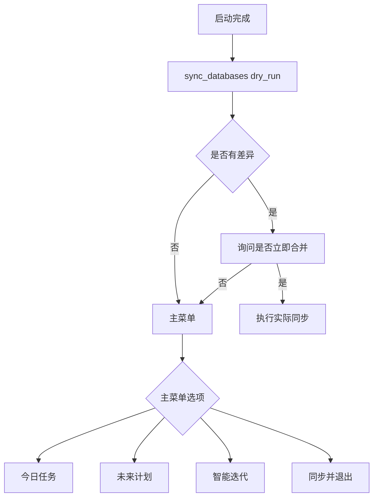

# 项目判断与分支走向总结

本文档描述当前启动、配置、云端冲突与主流程的真实分支。它是“如何走到哪个路径”的说明，不是历史方案记录。

## 1. 启动与配置加载

### `config.py`

- 先加载根目录 `.env`，再加载用户 profile。
- 如果 `MOMO_USER` 已经由环境指定，就直接使用该用户。
- 如果是 pytest 运行且未指定 `MOMO_USER`，会自动降级为 `test_user`，避免交互式选择。
- 用户配置优先于全局配置；敏感用户级键会从当前进程环境中清理后再覆盖。

### `ProfileManager.pick_profile()`

- 有现成 profile 时，优先选择已有用户。
- 没有用户时，进入 `ConfigWizard.run_setup()`。
- 已存在 profile 但缺云端配置时，会询问是否自动启用云数据库。

```mermaid
flowchart TD
  A[启动 config.py] --> B{MOMO_USER 是否已指定}
  B -- 是 --> C[直接使用指定用户]
  B -- 否 --> D[ProfileManager.pick_profile()]
  D --> E{已有 profile?}
  E -- 是 --> F[进入用户选择/补云端配置]
  E -- 否 --> G[ConfigWizard.run_setup()]
```

## 2. 新用户与云端配置

### `ConfigWizard.run_setup()`

- 用户名可用后继续。
- `MOMO_TOKEN`、AI Key 都是可跳过的，默认是“先保存后校验”。
- 隐藏输入用于 Token / API Key / Turso token。
- 校验返回结构化结果：`ok/category/detail`。
- 最后写入 profile 并调用 `tools/preflight_check.py` 作为统一体检提示。

### `ConfigWizard.ensure_cloud_database_for_profile()`

- 只在 profile 缺少 `TURSO_DB_URL` 时触发。
- 如果用户拒绝，直接保留本地模式。
- 如果启用，则使用管理令牌创建用户云库并写回 profile。

### `ConfigWizard._ensure_hub_initialized()`

- 先检查全局 Hub 配置是否存在。
- 没有时会自动创建或复用 `momo-users-hub`。
- 初始化 Hub 的用户表、会话表、统计表和审计表。

## 3. 主流程启动

### `StudyFlowManager.__init__()`

- 初始化 logger、数据库和用户会话。
- 如果 `AI_PROVIDER=mimo`，需要 `MIMO_API_KEY`。
- 如果 `AI_PROVIDER=gemini`，需要 `GEMINI_API_KEY`。
- 强制云端模式缺少 Hub 配置时，会提供：
  - 立即补配置
  - 本次会话临时降级
  - 退出并打印修复清单

## 4. 主菜单分支

- `1` 今日任务：拉取今日词汇，批量 AI 生成后写回并触发后台同步。
- `2` 未来计划：默认 7 天，可自定义天数。
- `3` 智能迭代：进入 `IterationManager.run_iteration()`。
- `4` 同步并退出：执行最终同步后退出。

## 5. 运行时同步

- 启动时先执行 `sync_databases(dry_run=True)` 看本地/云端差异。
- 有差异时，询问是否立即合并。
- 每次任务完成后，`_trigger_post_run_sync()` 会触发后台同步。
- 退出时再次执行同步，避免最后一批数据丢失。



## 6. 相关文档

- [ARCHITECTURE.md](ARCHITECTURE.md)
- [../dev/AI_CONTEXT.md](../dev/AI_CONTEXT.md)
- [../dev/AUTO_SYNC.md](../dev/AUTO_SYNC.md)

---

## 7. 配置与凭证分支

### 7.1 首次配置向导分支

- 新用户可直接在向导中配置云数据库；也可"先保存后校验"或选择跳过，后续再补。
- 向导内凭证校验返回结构化结果（`ok/category/detail`），便于前端/日志辨识失败原因。

### 7.2 云数据库启用分支

- `TURSO_DB_URL` + `TURSO_AUTH_TOKEN` 存在：启用云端数据库同步。
- 不存在：使用本地 SQLite，云同步功能失效。
- `libsql` 未安装：即便配置了 Turso，也退回本地。

### 7.3 管理员权限分支

- 通过 `ADMIN_PASSWORD_HASH` 判断是否需要做管理员校验。
- `asher` 始终被视为管理员角色。
- 管理员相关操作如云数据库创建和 Hub 日志记录具备分支保护。

---

## 8. 建议阅读顺序

1. `config.py`：了解启动与配置加载流程。
2. `core/profile_manager.py`：理解用户选择与现有用户分支。
3. `core/config_wizard.py`：分析新用户创建、云数据库启用与 Hub 初始化分支。
4. `main.py`：查看运行时菜单与主流程分支。
5. `database/connection.py` + `database/momo_words.py`：掌握单例连接、写队列、云/本地写入分支与 `sync_databases()` 实现（`core/db_manager.py` 是兼容 facade，不推荐读）。
6. `core/iteration_manager.py`：理解 AI 迭代决策分支。

---

## 9. 结论

此项目的核心判断分支集中在三条线：

1. 用户配置选择：环境变量 `MOMO_USER` / 已有用户 / 新用户。
2. 云数据库启用：是否有 Turso 配置，以及是否通过管理员校验。
3. 运行时分支：今日任务 / 未来计划 / 智能迭代 / 同步退出。

这些分支共同决定了程序是否使用本地模式、是否启用云同步、是否写入中央 Hub 以及最终用户交互流程。
