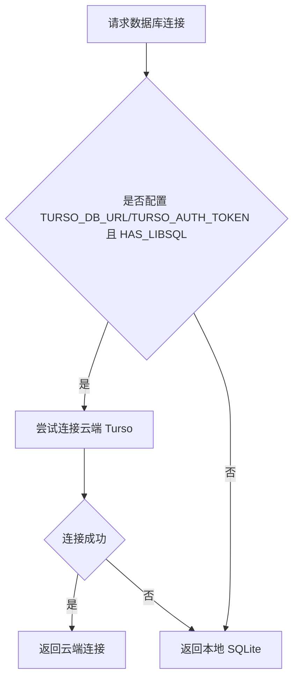

# 项目判断与分支走向总结

本文档梳理 `MOMO_Script` 项目中主要判断逻辑、分支流程以及各个模块间的决策路径，帮助快速理解程序运行过程。

---

## 1. 启动与配置加载流程

### 1.1 `config.py` 启动分支

- 先加载根目录 `.env`（如果存在），用于读取全局配置。
- 读取 `MOMO_USER` 环境变量：
  - 如果存在，则直接使用该用户名为当前活动用户。
  - 如果不存在，则等 `ProfileManager.pick_profile()` 完成后再确定活动用户。
- 用户选择完成后，读取对应 `data/profiles/{username}.env`，并覆盖全局配置。
- 此后才确定 `DB_PATH` / `TEST_DB_PATH`，保证用户选择完成再生成用户数据库路径。

### 1.2 `ProfileManager.pick_profile()` 的分支

- 列出 `data/profiles/*.env` 中已有用户。
- 提供两类选择：
  - 选择已有用户。
  - 创建新用户。
- 选择已有用户时，会调用 `ConfigWizard.ensure_cloud_database_for_profile(username)`：
  - 如果该用户已配置 `TURSO_DB_URL` 和 `TURSO_AUTH_TOKEN`，直接返回。
  - 否则提示是否启用 Turso 云数据库：
    - 选择“否”：保持当前用户，不创建云数据库。
    - 选择“是”：继续管理员密码校验，并发起云数据库创建流程。
- 选择创建新用户时，进入 `ConfigWizard.run_setup()` 新用户向导。

```mermaid
flowchart TD
  A[启动 config.py] --> B{是否存在 MOMO_USER}
  B -- 是 --> C[使用环境指定用户]
  B -- 否 --> D[ProfileManager.pick_profile()]
  D --> E{选择已有用户 或 创建新用户}
  E -- 已有用户 --> F[ensure_cloud_database_for_profile()]
  E -- 新用户 --> G[run_setup()]
  F --> H{是否已配置 Turso 云数据库}
  H -- 是 --> I[直接返回当前用户]
  H -- 否 --> J[询问是否启用 Turso 云数据库]
  J -- 否 --> I
  J -- 是 --> K[验证管理员密码] --> L[创建 Turso 云数据库]
  G --> M[新用户初始化向导]
```

---

## 2. 新用户初始化与云数据库创建流程

### 2.1 `ConfigWizard.run_setup()` 判断与分支

- 收集用户名。
- 验证 `MOMO_TOKEN`：使用 `MaiMemoAPI.get_study_progress()` 判断 Token 是否可用。
- 选择 AI 提供商：
  - `1` -> `mimo`
  - `2` -> `gemini`
- 根据选择验证对应 API Key：
  - `mimo` -> `validate_mimo()`。
  - `gemini` -> `validate_gemini()`。
- 询问是否创建专属 Turso 云数据库：
  - 选择“否”时，仅保存本地配置。
  - 选择“是”时执行：
    - 管理员密码校验 `_verify_admin_password()`：
      - 若根 `.env` 无 `ADMIN_PASSWORD_HASH`，直接跳过校验。
      - 否则允许最多 3 次输入。
      - 校验失败则跳过云数据库创建。
    - 输入 `organizationSlug`、`group`、`Turso Auth Token`。
    - 调用 `_create_turso_database()` 创建数据库：
      - 成功则继续。
      - 失败则提示用户后继续保存本地配置。
    - 调用 `_ensure_hub_initialized()`：
      - 若全局 Hub 已配置，则复用现有配置。
      - 否则创建或获取名为 `momo_users_hub` 的中央 Hub 云数据库。
      - 为 Hub 生成认证令牌并保存到全局 `.env`。
      - 初始化 Hub 表结构 `init_users_hub_tables()`。
    - 保存用户信息到 Hub `save_user_info_to_hub()`。
- 创建本地 sqlite 数据库并初始化表结构。
- 将用户配置写入 `data/profiles/{username}.env`。

### 2.2 `ensure_cloud_database_for_profile()` 判断与分支

- 读取用户配置文件。
- 如果 `TURSO_DB_URL` 和 `TURSO_AUTH_TOKEN` 已存在，立即返回。
- 否则询问是否启用云数据库：
  - 否：直接返回。
  - 是：继续管理员密码验证。
- 验证通过后输入组织信息、group 与 Turso Token。
- 调用 `_configure_cloud_for_user()` 完成云数据库创建并更新用户 `.env`。

```mermaid
flowchart TD
  A[新用户向导 run_setup] --> B[输入用户名]
  B --> C[验证 MOMO_TOKEN]
  C --> D[选择 AI 提供商]
  D --> E[验证对应 API Key]
  E --> F{是否创建 Turso 云数据库}
  F -- 否 --> G[保存本地配置]
  F -- 是 --> H[验证管理员密码]
  H -- 成功 --> I[创建 Turso 数据库]
  H -- 失败 --> G
  I --> J[_ensure_hub_initialized()]
  J --> K[保存用户信息到 Hub]
  K --> G
```

---

## 3. 中央 Hub（Users Hub）逻辑

### 3.1 Hub 配置与初始化分支

- `_ensure_hub_initialized()` 先检查全局环境变量：
  - `TURSO_HUB_DB_URL`
  - `TURSO_HUB_AUTH_TOKEN`
- 如果已存在，则复用现有 Hub 配置。
- 如果不存在，则：
  - 创建或获取 `momo_users_hub` 数据库。
  - 生成 Hub 数据库认证令牌。
  - 保存 Hub 配置到全局 `.env`。
  - 初始化 Hub 数据库表结构。

### 3.2 Hub 表相关判断

- `save_user_info_to_hub()`：
  - 判断用户是否已存在（通过 `user_id` 或 `username`）。
  - 若已存在，则保留原始 `created_at` 和 `role`。
  - 如果用户名为 `asher`，强制设为 `admin`。
- `is_admin_username()`：
  - 先判断用户名是否为 `asher`。
  - 否则从 Hub 查询用户角色，只有 `role='admin'` 才返回真。
- `save_user_session()`、`update_user_stats()`、`log_admin_action()` 等：
  - 只有在 Hub 配置和 `libsql` 可用时才会正常写入。
  - 失败只记录日志，不抛出致命异常。

---

## 4. 数据库连接与读写分支

### 4.1 `_get_conn()` 分支

- 首先判断是否有云端配置且安装 `libsql`。
- 如果目标数据库是主数据库或测试数据库，且云端 URL/token 存在：
  - 尝试连接 Turso 云端数据库。
  - 失败后会回退到本地 SQLite。
- 如果没有云端配置，直接连接本地 SQLite。

### 4.2 `init_db()` 分支

- 永远先初始化本地数据库。
- 如果 `HAS_LIBSQL` 且 `TURSO_DB_URL`/`TURSO_AUTH_TOKEN` 存在，则尝试初始化云端数据库表。
- 云端初始化失败仅日志记录，不阻止程序继续运行。

### 4.3 写入逻辑分支

- `mark_processed()` 和 `save_ai_word_note()`：
  - 首先尝试写入云端（如果云端连接可用）。
  - 如果云端写入成功，则额外同步到本地缓存。
  - 如果云端不可用或失败，则回退写入本地 SQLite。
- `sync_databases()`：
  - 若云端未配置或 `libsql` 不可用，则直接返回 `{upload:0, download:0}`。
  - 否则执行双向同步：本地新数据上传、云端新数据下载。



---

## 5. 运行时主流程判断

### 5.1 `main.py` 启动分支

- 初始化 `StudyFlowManager`：
  - 创建日志与会话 ID。
  - `MaiMemoAPI(MOMO_TOKEN)`。
  - `init_db()` 初始化本地/云数据库。
  - 查询 Hub 中当前用户信息。
  - 判断用户是否为管理员。
  - 尝试记录用户会话与登录时间到 Hub。
- 如果 `AI_PROVIDER` 为 `mimo`，则要求 `MIMO_API_KEY`；否则要求 `GEMINI_API_KEY`。

### 5.2 同步判断与分支

- 启动时调用 `sync_databases(dry_run=True)`：
  - 如果发现云端与本地差异，则提示用户是否立即合并。
  - 若用户选择继续，则执行实际同步。
  - 否则记录警告并继续。

### 5.3 主菜单分支

程序主循环提供 4 个选项：

1. `今日任务`：
   - 调用 `MaiMemoAPI.get_today_items(limit=500)`。
   - 处理返回任务列表。
   - 运行后触发后台同步。
2. `未来计划`：
   - 默认查询 7 天任务。
   - 允许用户输入自定义天数。
   - 返回值为空、解析失败或输入无效时，会回到主菜单。
3. `智能迭代`：
   - 进入 `IterationManager.run_iteration()`。
4. `同步&退出`：
   - 执行一次 `sync_databases(dry_run=False)`，然后退出。

```mermaid
flowchart TD
  A[启动完成] --> B[同步差异检查 dry_run]
  B --> C{是否有差异}
  C -- 有 --> D[询问是否立即合并]
  D -- Y --> E[执行 sync_databases(False)]
  D -- N --> F[继续主菜单]
  C -- 否 --> F
  F --> G[主菜单]
  G --> H{选项}
  H --> |1| I[今日任务]
  H --> |2| J[未来计划]
  H --> |3| K[智能迭代]
  H --> |4| L[同步&退出]
```

---

## 6. AI 迭代与智能分支

### 6.1 `IterationManager.run_iteration()` 分支

- 先读取“弱熟悉度”单词列表。
- 如果没有弱词，直接停止。
- 对每个弱词：
  - 如果 `it_level == 0`：进入 Level 1 选优分支。
  - 否则进入 Level 2+ 强力重炼分支。
- Level 2+ 还会比较当前熟悉度与上次基线：
  - 如果熟悉度没有提升，则继续重炼。
  - 否则仅记录“保持观察”。

### 6.2 云词本同步分支

- `_sync_weak_words_notepad()`：
  - 先尝试获取标题为 `MomoAgent: 薄弱词攻坚` 的词本。
  - 如果存在，则更新内容。
  - 如果不存在，则创建新词本。
  - 如果没有新增词，则跳过。

---

## 7. 关键分支汇总

### 7.1 用户选择与配置分支

- `MOMO_USER` 环境变量优先。
- 若不存在，进入用户选择菜单。
- 已有用户会被询问是否启用 Turso 云数据库。
- 新用户可直接在向导中配置云数据库。

### 7.2 云数据库启用分支

- `TURSO_DB_URL` + `TURSO_AUTH_TOKEN` 存在：启用云端数据库同步。
- 不存在：使用本地 SQLite，云同步功能失效。
- `libsql` 未安装：即便配置了 Turso，也退回本地。

### 7.3 管理员权限分支

- 通过 `ADMIN_PASSWORD_HASH` 判断是否需要做管理员校验。
- `asher` 始终被视为管理员角色。
- 管理员相关操作如云数据库创建和 Hub 日志记录具备分支保护。

---

## 8. 建议阅读顺序

1. `config.py`：了解启动与配置加载流程。
2. `core/profile_manager.py`：理解用户选择与现有用户分支。
3. `core/config_wizard.py`：分析新用户创建、云数据库启用与 Hub 初始化分支。
4. `main.py`：查看运行时菜单与主流程分支。
5. `core/db_manager.py`：掌握数据库连接、云/本地写入、同步与 Hub 分支。
6. `core/iteration_manager.py`：理解 AI 迭代决策分支。

---

## 9. 结论

此项目的核心判断分支集中在三条线：

1. 用户配置选择：环境变量 `MOMO_USER` / 已有用户 / 新用户。
2. 云数据库启用：是否有 Turso 配置，以及是否通过管理员校验。
3. 运行时分支：今日任务 / 未来计划 / 智能迭代 / 同步退出。

这些分支共同决定了程序是否使用本地模式、是否启用云同步、是否写入中央 Hub 以及最终用户交互流程。
