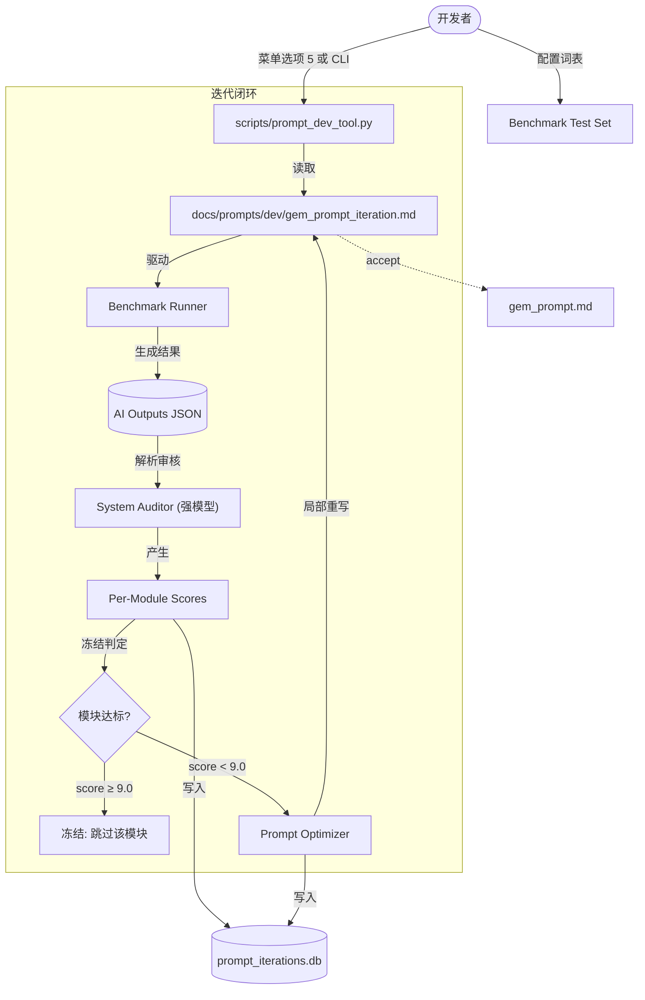

# AI 提示词迭代优化系统 — 实施计划 (V5-Final)

> **状态**: ✅ 已通过用户评审，开始执行
> **创建日期**: 2026-04-16
> **用户确认参数**: 冻结阈值 9.0 | 测试词 20 个 | 审计用强模型 | 融合到现有菜单

---

## 1. 系统定位

```
┌────────────────────────────────┐     ┌────────────────────────────────┐
│   Prompt-Level Iteration       │     │   Word-Level Iteration         │
│   (本系统)                      │     │   (iteration_manager.py)       │
│                                │     │                                │
│   优化目标: gem_prompt.md 本身  │     │   优化目标: 单个单词的助记内容  │
│   触发方式: CLI + 菜单选项 5    │     │   触发方式: 薄弱词自动筛选      │
│   AI 角色: Auditor + Optimizer │     │   AI 角色: Scorer + Refiner    │
│   数据存储: prompt_iterations  │     │   数据存储: ai_word_iterations │
│                                │     │                                │
│   共享: AI Client 接口          │     │   共享: AI Client 接口          │
└────────────────────────────────┘     └────────────────────────────────┘
```

---

## 2. 架构设计



---

## 3. 数据库设计

使用独立的 `data/prompt_iterations.db`，不污染用户生产数据库。

### 3.1 表结构

```sql
-- 表 1：Prompt 版本快照
CREATE TABLE IF NOT EXISTS prompt_versions (
    id INTEGER PRIMARY KEY AUTOINCREMENT,
    version_hash TEXT UNIQUE NOT NULL,     -- SHA256 前 12 位
    content TEXT NOT NULL,                  -- gem_prompt_iteration.md 全文
    parent_hash TEXT,                       -- 上一版本的 hash（溯源链）
    source TEXT DEFAULT 'optimizer',        -- 'init' | 'optimizer' | 'manual'
    created_at TEXT NOT NULL                -- ISO 8601 含时区
);

-- 表 2：评估轮次
CREATE TABLE IF NOT EXISTS evaluation_rounds (
    id INTEGER PRIMARY KEY AUTOINCREMENT,
    round_number INTEGER NOT NULL,          -- 全局递增轮号
    version_hash TEXT NOT NULL,             -- 对应的 prompt 版本
    ai_provider TEXT,                       -- 'gemini' | 'mimo'
    model_name TEXT,
    test_words TEXT,                        -- JSON 数组，本轮测试词
    avg_score REAL,                         -- 所有模块平均分
    total_prompt_tokens INTEGER DEFAULT 0,
    total_completion_tokens INTEGER DEFAULT 0,
    created_at TEXT NOT NULL,
    FOREIGN KEY(version_hash) REFERENCES prompt_versions(version_hash)
);

-- 表 3：模块级评分（核心追溯表）
CREATE TABLE IF NOT EXISTS module_scores (
    id INTEGER PRIMARY KEY AUTOINCREMENT,
    round_id INTEGER NOT NULL,
    test_word TEXT NOT NULL,                -- 被测单词
    module_name TEXT NOT NULL,              -- 'basic_meanings' | 'ielts_focus' | ...
    score REAL NOT NULL,
    feedback TEXT,                          -- 审计器的诊断反馈
    fix_suggestion TEXT,                    -- 建议的修复方向
    created_at TEXT NOT NULL,
    FOREIGN KEY(round_id) REFERENCES evaluation_rounds(id)
);

-- 表 4：优化决策记录
CREATE TABLE IF NOT EXISTS optimization_actions (
    id INTEGER PRIMARY KEY AUTOINCREMENT,
    round_id INTEGER NOT NULL,
    target_modules TEXT NOT NULL,           -- JSON 数组: ["memory_aid", "example_sentences"]
    frozen_modules TEXT NOT NULL,           -- JSON 数组: 本轮被冻结的模块
    input_version_hash TEXT NOT NULL,       -- 优化前的版本
    output_version_hash TEXT NOT NULL,      -- 优化后的版本
    optimizer_reasoning TEXT,               -- AI 优化器给出的修改理由
    created_at TEXT NOT NULL,
    FOREIGN KEY(round_id) REFERENCES evaluation_rounds(id)
);
```

### 3.2 查询示例

```sql
-- 查看某个模块的分数趋势
SELECT er.round_number, ms.module_name, AVG(ms.score) as avg_score
FROM module_scores ms
JOIN evaluation_rounds er ON ms.round_id = er.id
GROUP BY er.round_number, ms.module_name
ORDER BY er.round_number;

-- 查看哪些模块在第 N 轮被冻结
SELECT frozen_modules FROM optimization_actions WHERE round_id = ?;

-- 回溯某一版本的完整 prompt 内容
SELECT content FROM prompt_versions WHERE version_hash = ?;
```

---

## 4. 分模块冻结优化机制

### 4.1 模块注册表

| 模块 ID | 对应 JSON 字段 | 对应 Prompt Section | 权重 |
|---------|---------------|-------------------|------|
| `meanings` | `basic_meanings` | Part A Logic | 15% |
| `ielts_depth` | `ielts_focus` | Field: "ielts_focus" | 15% |
| `collocations` | `collocations` | Field: "collocations" | 10% |
| `traps` | `traps` | Field: "traps" | 10% |
| `synonyms` | `synonyms` | Field: "synonyms" | 10% |
| `discrimination` | `discrimination` | Field: "discrimination" | 5% |
| `sentences` | `example_sentences` | Field: "example_sentences" | 15% |
| `memory` | `memory_aid` | Field: "memory_aid" | 10% |
| `ratings` | `word_ratings` | Field: "word_ratings" | 5% |
| `format` | *(整体)* | Output Structure | 5% |

### 4.2 冻结逻辑

- **冻结阈值**: 9.0（用户确认）
- 每轮评估后重新计算模块状态
- 若已冻结模块的分数回退至 < 9.0，自动解冻

### 4.3 Optimizer 指令模板

```
你是一个 Prompt Engineering 专家。以下是当前的 System Prompt：
{current_prompt}

本轮审计发现以下模块需要改进：
{low_score_feedback}

以下模块已达标，**严禁修改**对应的 Prompt Section：
{frozen_module_list}

请仅修改需要改进的模块对应的 Prompt Section，保持其余部分完全不变。
输出完整的修改后 Prompt 文本。
```

---

## 5. Auditor 输出格式

遵循 `AI_CONTEXT.md` Rule 19，强制返回纯 JSON 数组：

```json
[
  {"field": "basic_meanings", "word": "run", "score": 9, "feedback": "合并逻辑极佳", "fix": ""},
  {"field": "example_sentences", "word": "run", "score": 6, "feedback": "语法结构过于简单", "fix": "增加从句复杂度要求"}
]
```

汇总统计在客户端侧计算，不依赖模型输出。

---

## 6. 路径注册

在 `config.py` 新增：

```python
PROMPT_DEV_DIR = os.path.join(BASE_DIR, "docs", "prompts", "dev")
PROMPT_DEV_FILE = os.path.join(PROMPT_DEV_DIR, "gem_prompt_iteration.md")
AUDITOR_PROMPT_FILE = os.path.join(BASE_DIR, "docs", "prompts", "evaluation", "system_auditor_prompt.md")
OPTIMIZER_PROMPT_FILE = os.path.join(PROMPT_DEV_DIR, "prompt_optimizer.md")
BENCHMARK_DIR = os.path.join(DATA_DIR, "benchmark")
PROMPT_ITERATION_DB = os.path.join(DATA_DIR, "prompt_iterations.db")
PROMPT_HISTORY_DIR = os.path.join(BASE_DIR, "docs", "prompts", "history")
```

---

## 7. 用户界面集成

### 7.1 主菜单变更 (`main.py`)

```
  1. [今日任务] 处理今日待复习 (X 个)
  2. [未来计划] 处理未来 7 天待学 (X 个)
  3. [智能迭代] 优化薄弱词助记 (基于数据反馈)
  4. [同步&退出] 保存所有数据并安全退出
  5. [Prompt 实验室] 提示词迭代优化工具          ← NEW
```

### 7.2 Prompt 实验室子菜单

```
═══════════════════════════════
🔬 Prompt 实验室
═══════════════════════════════
  1. [初始化] 将生产 Prompt 拷贝到开发环境
  2. [评估] 运行 Benchmark 跑分
  3. [优化] 自动改写低分模块 (冻结高分)
  4. [自动循环] 连续迭代 N 轮 (含收敛检测)
  5. [历史趋势] 查看模块分数变化
  6. [上线] 同步到生产环境 (含 Dry Run 安全检查)
  7. [回滚] 恢复到指定历史版本
  0. ← 返回主菜单
```

### 7.3 独立 CLI（同时保留）

```bash
python scripts/prompt_dev_tool.py init
python scripts/prompt_dev_tool.py evaluate
python scripts/prompt_dev_tool.py optimize --freeze-threshold 9.0
python scripts/prompt_dev_tool.py loop --rounds 5
python scripts/prompt_dev_tool.py history
python scripts/prompt_dev_tool.py accept
python scripts/prompt_dev_tool.py rollback <version_hash>
```

---

## 8. 目录结构

```text
MoMo_Script/
├── data/
│   ├── benchmark/
│   │   └── custom_test_set.json          # 20 个基准测试词
│   └── prompt_iterations.db              # 迭代追溯数据库 [NEW]
├── docs/prompts/
│   ├── dev/
│   │   ├── gem_prompt_iteration.md       # 活跃开发版 (git ignored)
│   │   └── prompt_optimizer.md           # 优化器专用提示词
│   ├── evaluation/
│   │   ├── system_auditor_prompt.md      # 审计器专用提示词
│   │   └── sample.md                     # 黄金标准参考 (已有)
│   └── history/                          # accept 时的版本快照 [NEW]
│       └── gem_prompt_<hash8>.md
├── scripts/
│   └── prompt_dev_tool.py                # CLI 主入口 [NEW]
├── docs/dev/
│   └── PROMPT_OPTIMIZER_PLAN.md          # 本计划 [NEW]
```

---

## 9. 安全与收敛机制

### 9.1 收敛检测
- 连续 2 轮 `avg_score` 变化 < 0.3 → 自动停止 loop
- Benchmark 测试词 < 10 个 → CLI 输出警告

### 9.2 防漂移机制
- 冻结守卫：高分模块锁定，Optimizer 不得触碰
- 一致性审查：每 3 轮检查 prompt 各 Section 之间的指令一致性

### 9.3 accept 安全
- 快照：`docs/prompts/history/gem_prompt_<hash8>.md`
- Dry Run：用 1 个常规词测试新 prompt，JSON 解析失败则拒绝上线
- 文档联动：自动追加 `CHANGELOG.md` 记录

---

## 10. 开发路线图

| 阶段 | 内容 | 产出 |
|------|------|------|
| **P1 基础设施** | config 路径注册 + 数据库建表 + dev 目录 + benchmark 初始化 | 基础文件就绪 |
| **P2 审计闭环** | 编写 `system_auditor_prompt.md` + 实现 `evaluate` 命令 | 可跑分 |
| **P3 冻结优化** | 编写 `prompt_optimizer.md` + 实现 `optimize` + 冻结逻辑 | 可优化 |
| **P4 自动化** | 实现 `loop` + 收敛检测 + 防漂移 | 闭环迭代 |
| **P5 菜单集成** | `main.py` 菜单选项 5 + 子菜单 | 用户可在主界面使用 |
| **P6 上线管理** | `accept` / `rollback` / `history` | 安全上线 |

---

## 11. 模型选择策略

| 角色 | 模型选择 | 原因 |
|------|---------|------|
| Benchmark Runner（生成测试输出） | 当前配置的模型（Mimo/Gemini） | 需要模拟生产环境 |
| System Auditor（审计评分） | **更强模型**（如 Gemini 2.5 Pro） | 需要精确判断雅思细节 |
| Prompt Optimizer（改写 Prompt） | 当前配置的模型 | 需要与生产模型风格一致 |

审计器使用独立的 API Key，可通过 `.env` 中的 `AUDITOR_API_KEY` / `AUDITOR_MODEL` 配置。

---

*文档更新时间：2026-04-16*
